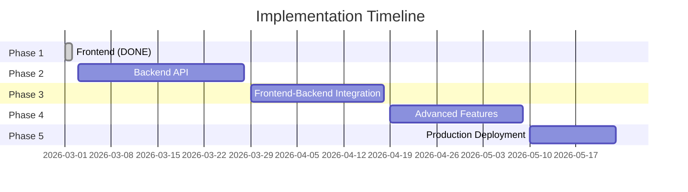

# 📋 Implementation Plan — Google Classroom Clone LMS

## Project Overview

A production-grade Learning Management System with 3 role-based experiences (Student, Faculty, Admin), 40+ pages, and 11 admin modules.

---

## Phase Summary

---

## ✅ Phase 1: Frontend (COMPLETED)

> All frontend pages and components are built and verified with zero TypeScript errors.

### Student Features — ✅ Done
| # | Feature | File | Status |
|---|---------|------|--------|
| 23 | Student Dashboard — upcoming assignments, countdown timers, grade summary, announcements | [StudentDashboardPage.tsx](file:///C:/Users/Avi/.gemini/antigravity/scratch/classroom-app/src/pages/student/StudentDashboardPage.tsx) | ✅ |
| 24 | Assignment List — filter/sort/search | [AssignmentListPage.tsx](file:///C:/Users/Avi/.gemini/antigravity/scratch/classroom-app/src/pages/student/AssignmentListPage.tsx) | ✅ |
| 25 | Assignment Detail — description, attachments, submission form, history | [AssignmentDetailPage.tsx](file:///C:/Users/Avi/.gemini/antigravity/scratch/classroom-app/src/pages/assignment/AssignmentDetailPage.tsx) | ✅ |
| 26 | File Upload — drag-and-drop, progress bar, validation | Built into Assignment Detail | ✅ |
| 27 | Grades Page — gradebook table, distribution chart, feedback | [GradesPage.tsx](file:///C:/Users/Avi/.gemini/antigravity/scratch/classroom-app/src/pages/student/GradesPage.tsx) | ✅ |

### Faculty Features — ✅ Done
| # | Feature | File | Status |
|---|---------|------|--------|
| 28 | Faculty Dashboard — pending submissions, analytics | [DashboardPage.tsx](file:///C:/Users/Avi/.gemini/antigravity/scratch/classroom-app/src/pages/dashboard/DashboardPage.tsx) | ✅ |
| 29 | Assignment Creator — rubric builder, settings | [AssignmentCreatorPage.tsx](file:///C:/Users/Avi/.gemini/antigravity/scratch/classroom-app/src/pages/faculty/AssignmentCreatorPage.tsx) | ✅ |
| 30 | Submissions Viewer — search, filter, plagiarism, CSV export | [SubmissionsViewerPage.tsx](file:///C:/Users/Avi/.gemini/antigravity/scratch/classroom-app/src/pages/faculty/SubmissionsViewerPage.tsx) | ✅ |
| 31 | Grading Interface — side-by-side rubric sliders | [GradingInterfacePage.tsx](file:///C:/Users/Avi/.gemini/antigravity/scratch/classroom-app/src/pages/faculty/GradingInterfacePage.tsx) | ✅ |
| 32 | Faculty Gradebook — spreadsheet-style, CSV export | [GradebookPage.tsx](file:///C:/Users/Avi/.gemini/antigravity/scratch/classroom-app/src/pages/faculty/GradebookPage.tsx) | ✅ |

### Admin Dashboard — ✅ Done (11 Modules)
| Module | File | Status |
|--------|------|--------|
| Overview — metrics, activity, health | [AdminOverview.tsx](file:///C:/Users/Avi/.gemini/antigravity/scratch/classroom-app/src/pages/admin/AdminOverview.tsx) | ✅ |
| User Management — CRUD, bulk import, roles | [UserManagement.tsx](file:///C:/Users/Avi/.gemini/antigravity/scratch/classroom-app/src/pages/admin/UserManagement.tsx) | ✅ |
| Cohorts & Courses | [CohortCourseManagement.tsx](file:///C:/Users/Avi/.gemini/antigravity/scratch/classroom-app/src/pages/admin/CohortCourseManagement.tsx) | ✅ |
| Assignment Oversight | [AssignmentOversight.tsx](file:///C:/Users/Avi/.gemini/antigravity/scratch/classroom-app/src/pages/admin/AssignmentOversight.tsx) | ✅ |
| Plagiarism Center | [PlagiarismCenter.tsx](file:///C:/Users/Avi/.gemini/antigravity/scratch/classroom-app/src/pages/admin/PlagiarismCenter.tsx) | ✅ |
| System Analytics | [SystemAnalytics.tsx](file:///C:/Users/Avi/.gemini/antigravity/scratch/classroom-app/src/pages/admin/SystemAnalytics.tsx) | ✅ |
| Audit Logs | [AuditLogs.tsx](file:///C:/Users/Avi/.gemini/antigravity/scratch/classroom-app/src/pages/admin/AuditLogs.tsx) | ✅ |
| System Config | [SystemConfig.tsx](file:///C:/Users/Avi/.gemini/antigravity/scratch/classroom-app/src/pages/admin/SystemConfig.tsx) | ✅ |
| Accessibility | [AccessibilitySettings.tsx](file:///C:/Users/Avi/.gemini/antigravity/scratch/classroom-app/src/pages/admin/AccessibilitySettings.tsx) | ✅ |
| Data & Backup | [DataBackup.tsx](file:///C:/Users/Avi/.gemini/antigravity/scratch/classroom-app/src/pages/admin/DataBackup.tsx) | ✅ |
| Risk Monitoring | [RiskMonitoring.tsx](file:///C:/Users/Avi/.gemini/antigravity/scratch/classroom-app/src/pages/admin/RiskMonitoring.tsx) | ✅ |

### Shared Components — ✅ Done
| Component | File | Status |
|-----------|------|--------|
| Header (notification bell, user menu) | [Header.tsx](file:///C:/Users/Avi/.gemini/antigravity/scratch/classroom-app/src/components/layout/Header.tsx) | ✅ |
| Sidebar (role-aware nav) | [Sidebar.tsx](file:///C:/Users/Avi/.gemini/antigravity/scratch/classroom-app/src/components/layout/Sidebar.tsx) | ✅ |
| Layout wrapper | [Layout.tsx](file:///C:/Users/Avi/.gemini/antigravity/scratch/classroom-app/src/components/layout/Layout.tsx) | ✅ |
| Notifications Panel | [NotificationsPanel.tsx](file:///C:/Users/Avi/.gemini/antigravity/scratch/classroom-app/src/components/notifications/NotificationsPanel.tsx) | ✅ |

### Stats
- **39 TypeScript files** — 0 compilation errors
- **40+ pages/modules** — all rendering correctly
- **3 roles** — Student, Faculty, Admin
- **Canvas-drawn charts** — no heavy chart library

---

## 🔵 Phase 2: Backend API (Weeks 1-4)

> [!IMPORTANT]
> Full specification: [BACKEND_GUIDE.md](file:///C:/Users/Avi/.gemini/antigravity/scratch/classroom-app/docs/BACKEND_GUIDE.md)

### Week 1-2: Foundation
| Task | Description | Status |
|------|-------------|--------|
| Project setup | Express + TypeScript + Prisma | ⬜ |
| Database schema | 15+ tables in PostgreSQL | ⬜ |
| Auth module | JWT login, signup, refresh tokens | ⬜ |
| User module | CRUD, role management | ⬜ |
| Middleware | Error handler, rate limiter, CORS, logger | ⬜ |

### Week 3: Core Business Logic
| Task | Description | Status |
|------|-------------|--------|
| Classes module | CRUD, join by code, member management | ⬜ |
| Assignments module | CRUD, rubrics, attachments | ⬜ |
| Submissions module | Submit, list, file handling | ⬜ |
| Upload module | S3 presigned URLs, file validation | ⬜ |

### Week 4: Grading & Admin
| Task | Description | Status |
|------|-------------|--------|
| Grades module | Grade submissions, rubric scores | ⬜ |
| Cohorts module | CRUD cohorts, member assignment | ⬜ |
| Admin module | Config, audit logs, analytics queries | ⬜ |
| Notifications module | Create + store notifications | ⬜ |

---

## 🟡 Phase 3: Frontend ↔ Backend Integration (Weeks 5-7)

> [!IMPORTANT]
> Full specification: [FRONTEND_GUIDE.md](file:///C:/Users/Avi/.gemini/antigravity/scratch/classroom-app/docs/FRONTEND_GUIDE.md)

### Week 5: Auth & Core
| Task | Description | Status |
|------|-------------|--------|
| API service layer | `src/services/api.ts` with interceptors | ⬜ |
| React Query setup | Provider, query client config | ⬜ |
| Auth flow | Real login/signup → JWT tokens | ⬜ |
| Classes hook | Replace mock `useAppStore().classes` | ⬜ |

### Week 6: Student Flow
| Task | Description | Status |
|------|-------------|--------|
| Assignment hooks | `useAssignments()`, `useSubmission()` | ✅ |
| File upload | Presigned URL flow → S3 | ✅ |
| Grades hook | `useGrades()` → real grade data | ✅ |
| Loading/error states | Skeletons, error boundaries | ✅ |

### Week 7: Faculty & Admin Flow
| Task | Description | Status |
|------|-------------|--------|
| Faculty hooks | Grading, submissions, gradebook | ✅ |
| Admin hooks | Users, cohorts, analytics, config | ✅ |
| Audit log integration | Real log data from backend | ✅ |
| Bulk import | CSV upload → backend processing | ✅ |

---

## ✅ Phase 4: Advanced Features (Weeks 8-10)

### Week 8: Real-time
| Task | Description | Status |
|------|-------------|--------|
| Socket.io setup | Server + client WebSocket | ✅ |
| Live notifications | Push when grade posted, deadline near | ✅ |
| Real-time submission status | Faculty sees new submissions instantly | ✅ |

### Week 9: AI & Plagiarism
| Task | Description | Status |
|------|-------------|--------|
| Plagiarism detection | Compare submissions, generate similarity scores | ⬜ |
| AI summaries | LLM-powered submission summaries | ⬜ |
| Background jobs | Bull queue for async processing | ⬜ |

### Week 10: Email & Reminders
| Task | Description | Status |
|------|-------------|--------|
| Email service | SendGrid/SES integration | ⬜ |
| Deadline reminders | Scheduled job: email N hours before due | ⬜ |
| Grade notifications | Email when grade posted | ⬜ |

---

## 🔴 Phase 5: Production Deployment (Weeks 11-12)

> [!IMPORTANT]
> Full specification: [DEVOPS_GUIDE.md](file:///C:/Users/Avi/.gemini/antigravity/scratch/classroom-app/docs/DEVOPS_GUIDE.md)

### Week 11: Infrastructure
| Task | Description | Status |
|------|-------------|--------|
| Docker images | Frontend + Backend Dockerfiles | ⬜ |
| CI/CD pipeline | GitHub Actions: lint → test → build → deploy | ⬜ |
| Cloud setup | PostgreSQL, Redis, S3 in cloud | ⬜ |
| SSL/DNS | Domain + HTTPS certificates | ⬜ |

### Week 12: Hardening
| Task | Description | Status |
|------|-------------|--------|
| Monitoring | Prometheus + Grafana dashboards | ⬜ |
| Error tracking | Sentry integration | ⬜ |
| Load testing | k6 or artillery stress tests | ⬜ |
| Security audit | OWASP checklist, dependency scanning | ⬜ |
| Backup automation | Daily DB + file backups | ⬜ |
| Documentation | API docs (Swagger/OpenAPI) | ⬜ |

---

## 📂 Documentation Index

| Document | Description | Path |
|----------|-------------|------|
| README.md | Project overview, quick start, tech stack | [README.md](file:///C:/Users/Avi/.gemini/antigravity/scratch/classroom-app/README.md) |
| Frontend Guide | API layer, React Query, WebSocket, migration checklist | [FRONTEND_GUIDE.md](file:///C:/Users/Avi/.gemini/antigravity/scratch/classroom-app/docs/FRONTEND_GUIDE.md) |
| Backend Guide | Express API, PostgreSQL schema, 50+ endpoints, JWT | [BACKEND_GUIDE.md](file:///C:/Users/Avi/.gemini/antigravity/scratch/classroom-app/docs/BACKEND_GUIDE.md) |
| DevOps Guide | Docker, CI/CD, AWS/Vercel, Terraform, monitoring | [DEVOPS_GUIDE.md](file:///C:/Users/Avi/.gemini/antigravity/scratch/classroom-app/docs/DEVOPS_GUIDE.md) |
